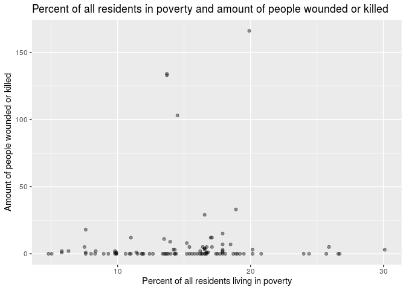
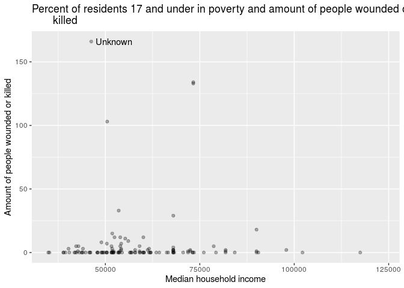

```r
library(tidyverse)
```

```
## ── Attaching packages ──────────────────────────────────────────────────────────────── tidyverse 1.2.1 ──
```

```
## ✔ ggplot2 3.2.1     ✔ purrr   0.3.3
## ✔ tibble  2.1.3     ✔ dplyr   0.8.3
## ✔ tidyr   1.0.0     ✔ stringr 1.4.0
## ✔ readr   1.3.1     ✔ forcats 0.4.0
```

```
## ── Conflicts ─────────────────────────────────────────────────────────────────── tidyverse_conflicts() ──
## ✖ dplyr::filter() masks stats::filter()
## ✖ dplyr::lag()    masks stats::lag()
```

```r
library(lubridate)
```

```
## 
## Attaching package: 'lubridate'
```

```
## The following object is masked from 'package:base':
## 
##     date
```

```r
#nanair is for changing values to na.
library(naniar)
#maps and mapdata are for making map plots.
library(maps)
```

```
## 
## Attaching package: 'maps'
```

```
## The following object is masked from 'package:purrr':
## 
##     map
```

```r
library(mapdata)
```


```r
county_city <- read.csv("data/county_city.csv")
GTD <- read.csv("data/GTD.csv")
population <- read.csv("data/population.csv")
poverty <- read.csv("data/poverty.csv")
states <- read.csv("data/states.csv")
```

Throughout this midterm, I put links to websites I used for reference in the form of the name of what I used for things that we may not have learned in class.

First off, we will clean the poverty data set so that it merges cleanly into the final data set. This includes turning the MEDHHINC_2015 variable into a numeric variable, and changing some words into different words.


```r
poverty2 <- poverty %>%
  mutate(MEDHHINC_2015 = as.numeric(str_remove_all(MEDHHINC_2015, (","))
  )) %>%
  mutate(Area_Name = str_replace_all(Area_Name, c(" County" = "", 
                                             " Census Area" = "",
                                             " Parish" = "",
                                             " Borough" = "",
                                             "McLennan" = "Mclennan",
                                             "District of Columbia" = "District Of Columbia",
                                             "DuPage" = "Du Page",
                                             "city" = "City",
                                             "St. Louis" = "Saint Louis",
                                             "St. Lucie" = "Saint Lucie")))
```
([str_replace_all](https://www.rdocumentation.org/packages/stringr/versions/1.4.0/topics/str_replace)) 
Now we will clean the county_city data set. This includes joining the poverty data set to it, as they have similar variables that can join, joining a data set that contain the state abbreviations and state names to make for easier merging into the final data set, changing some words in the data set so that they merge correctly, taking out useless variables that clog the final data set, and changing the variable "name" to "state_name" for clarity.

```r
#I deleted row 11873 from county_city because that row had no county name in it, was not needed, and was messing my final data set up.
county_city2 <- county_city[-c(11873),] %>%
  left_join(states, by = c("state" = "abbreviation"))%>%
  left_join(poverty2, by = c("county" = "Area_Name", "state" = "State"))%>%
  select(-latitude, -longitude, -area)%>%
  distinct()%>%
  mutate(city = str_replace_all(city, c("Mc Cook" = "McCook",
                                        "New York" = "New York City",
                                        "Inglewood" = "Ingelwood",
                                        "Tyngsboro" = "Tyngsborough",
                                        "Saint Louis" = "St. Louis",
                                        "Saint Cloud" = "St. Cloud")))
```

```
## Warning: Column `state`/`abbreviation` joining factors with different
## levels, coercing to character vector
```

```
## Warning: Column `county`/`Area_Name` joining factor and character vector,
## coercing into character vector
```

```
## Warning: Column `state`/`State` joining character vector and factor,
## coercing into character vector
```

```r
colnames(county_city2)[colnames(county_city2)=="name"] <- "state_name"
```
([renaming a column](http://rprogramming.net/rename-columns-in-r/)) 
Now we will clean the GTD data set. All this entails is adding an observation column to keep track of our rows easier.

```r
GTD <- GTD %>%
  mutate(observation = row_number())
```

Now we will clean the population data set. To do this we change some words in the data set so that they merge properly, and we also take out unnecessary variables so that it merges properly.

```r
population2 <- population %>%
  select(-SUMLEV,-STATE,-COUNTY,-PLACE)%>%
  arrange(NAME)%>%
  distinct()%>%
  mutate(NAME = str_replace_all(NAME, c("New York city" = "New York City",
                                        "Macon-Bibb County" = "Macon",
                                        " city" = "", 
                                        " township" = "",
                                        " town" = "",
                                        " Town" = "",
                                        " village" = "",
                                        " borough" = "",
                                        "Inglewood" = "Ingelwood")))
```


Now we will merge our two data sets, population2 an county_city2, with GTD to make our final data set. We will also make a date variable that combines the three date variables into one.

```r
midterm_data_ethan37_1 <- GTD %>%
  mutate(date = make_date(iyear, imonth, iday))%>%
  left_join(population2, by = c("city" = "NAME", "provstate" = "STNAME")) %>%
  left_join(county_city2, by = c("city", "provstate" = "state_name" )) %>%
  distinct()%>%
  droplevels()
```

```
## Warning: Column `city`/`NAME` joining factor and character vector, coercing
## into character vector
```

```
## Warning: Column `provstate`/`STNAME` joining factors with different levels,
## coercing to character vector
```

```
## Warning: Column `provstate`/`state_name` joining character vector and
## factor, coercing into character vector
```

Now it is time to clean our final data set.

First, we will check for spelling differences and see if that fixes why we have NA for the population estimates for some rows.

```r
midterm_data_ethan37_1 %>%
  filter(is.na(POPESTIMATE2013) | is.na(POPESTIMATE2014) | is.na(POPESTIMATE2015) | is.na(POPESTIMATE2016))
```

```
##   iyear imonth iday      provstate             city latitude  longitude
## 1  2015      6   26 South Carolina      Warrenville 33.50506  -81.81826
## 2  2016      1    2         Oregon        Princeton 43.26584 -118.84408
## 3  2016      2   28     California Lake Los Angeles 34.60598 -117.82995
## 4  2016      8    9       New York         New City 41.16624  -73.99150
## 5  2016      8    9       New York         New City 41.16240  -74.00490
##   vicinity
## 1        0
## 2        0
## 3        0
## 4        0
## 5        0
##                                                                                                                                                                                                                                                                                                                                                                                                                                                                                                                                                                                                                                                                                                                                                                                        summary
## 1                                                                                                                                                                                                                                                                                                                                                                                                                                                                                                                                                              06/26/2015: Assailants set fire to the Glover Grove Missionary Baptist Church in Warrenville, South Carolina, United States. There were no reported casualties in the attack. No group claimed responsibility for the incident.
## 2 01/02/2016: At least 12 armed assailants seized the Malheur National Wildlife Refuge headquarters in Princeton, Oregon, United States. On January 26, 2016, a leader of the group was killed, Ryan Bundy was wounded, and seven leaders, including Ammon and Ryan Bundy, were arrested in a confrontation with authorities approximately 45 miles away from the refuge. The last four assailants at the refuge were arrested on February 11, 2016. Citizens for Constitutional Freedom claimed responsibility for the incident and demanded that federal grounds be returned to the ranchers of Harney County. The group also stated that the occupation was carried out in protest to the five year sentence of Dwight and Steven Hammond, two ranchers convicted of arson of federal land.
## 3                                                                                                                                                                                                                                                                              02/28/2016: Three assailants armed with knives attacked a group of Hispanic teenagers playing soccer at Stephen Sorensen Park in Lake Los Angeles, California, United States. At least two people suffered minor injuries in the assault. The three assailants, identified as Ian Justine Plankey, Richard Lawrence Daulton, and Kevin Matthew Stewart, were arrested following the incident. During the attack, they shouted white supremacist statements and racial slurs, including "Heil Hitler, AV Skins."
## 4                                                                                                                                                                                                                                                                                                                                                                                                                                                                                                      08/09/2016: Assailants threw a firecracker at the house of Rabbi Avremel Kotlarsky in New City, New York, United States. There were no reported casualties in the attack. This was one of two coordinated attacks on the same night. No group claimed responsibility for the incidents.
## 5                                                                                                                                                                                                                                                                                                                                                                                                                                                                                                     08/09/2016: Assailants threw a firecracker at the house of Rabbi Simcha Morgenstern in New City, New York, United States. There were no reported casualties in the attack. This was one of two coordinated attacks on the same night. No group claimed responsibility for the incidents.
##   doubtterr multiple success suicide attacktype1
## 1         1        0       1       0           7
## 2         0        0       1       0           7
## 3         0        0       1       0           2
## 4         0        1       1       0           3
## 5         0        1       1       0           3
##                  attacktype1_txt targtype1                  targtype1_txt
## 1 Facility/Infrastructure Attack        15 Religious Figures/Institutions
## 2 Facility/Infrastructure Attack         2           Government (General)
## 3                  Armed Assault        14    Private Citizens & Property
## 4              Bombing/Explosion        15 Religious Figures/Institutions
## 5              Bombing/Explosion        15 Religious Figures/Institutions
##   targsubtype1                    targsubtype1_txt
## 1           86                    Place of Worship
## 2           21 Government Building/Facility/Office
## 3           71           Race/Ethnicity Identified
## 4           85                    Religious Figure
## 5           85                    Religious Figure
##                                     corp1                          target1
## 1  Glover Grove Missionary Baptist Church                           Church
## 2 United States Fish and Wildlife Service Malheur National Wildlife Refuge
## 3                          Not Applicable               Hispanic Civilians
## 4                                 Unknown         Rabbi: Avremel Kotlarsky
## 5                                 Unknown        Rabbi: Simcha Morgenstern
##                                 gname individual nperps nperpcap claimed
## 1                             Unknown          0    -99        0       0
## 2 Citizens for Constitutional Freedom          0     12       11       1
## 3                    White extremists          1      3        3       0
## 4                             Unknown          0      4        0       0
## 5                             Unknown          0    -99        0       0
##   weaptype1             weaptype1_txt weapsubtype1
## 1         8                Incendiary           18
## 2         5                  Firearms            2
## 3         9                     Melee           23
## 4         6 Explosives/Bombs/Dynamite           17
## 5         6 Explosives/Bombs/Dynamite           17
##              weapsubtype1_txt nkill nwound property propextent
## 1                  Arson/Fire     0      0        1          3
## 2            Automatic Weapon     0      0        0         NA
## 3 Knife or Other Sharp Object     0      3        0         NA
## 4        Other Explosive Type     0      0        1          3
## 5        Other Explosive Type     0      0       -9         NA
##                propextent_txt propvalue
## 1 Minor (likely < $1 million)       -99
## 2                                    NA
## 3                                    NA
## 4 Minor (likely < $1 million)       -99
## 5                                    NA
##                                     propcomment
## 1 A church building was damaged in this attack.
## 2                                              
## 3                                              
## 4           Shrubs were damaged in this attack.
## 5                                              
##                                                                                                                    scite1
## 1                                                                   "Fires at churches in spotlight," CNN, June 29, 2015.
## 2              "Protesters occupy Oregon wildlife refuge as dispute over Western range flares," Reuters, January 3, 2016.
## 3  "3 men are charged with hate crimes in an attack on Latinos at an L.A. County park," Los Angeles Times, March 3, 2016.
## 4 "Homes of Two New York Rabbis Hit in Alleged Coordinated Firecracker Attack," Five Towns Jewish Times, August 12, 2016.
## 5 "Homes of Two New York Rabbis Hit in Alleged Coordinated Firecracker Attack," Five Towns Jewish Times, August 12, 2016.
##   observation       date POPESTIMATE2013 POPESTIMATE2014 POPESTIMATE2015
## 1          59 2015-06-26              NA              NA              NA
## 2          86 2016-01-02              NA              NA              NA
## 3          91 2016-02-28              NA              NA              NA
## 4         119 2016-08-09              NA              NA              NA
## 5         120 2016-08-09              NA              NA              NA
##   POPESTIMATE2016 state   county PCTPOVALL_2015 PCTPOV017_2015
## 1              NA    SC    Aiken           18.1           27.1
## 2              NA    OR   Harney           16.3           25.5
## 3              NA  <NA>     <NA>             NA             NA
## 4              NA    NY Rockland           14.0           23.0
## 5              NA    NY Rockland           14.0           23.0
##   MEDHHINC_2015
## 1         48012
## 2         40468
## 3            NA
## 4         84249
## 5         84249
```
The cities we originally had NA for were New York City, Macon, Warrenville, Ingelwood, Princeton, Lake Los Angeles, and New City.

Now we look at the population data set where either the city name or the state name is in it to see if we can see why these didn't show up. Any cities I can not find I will find online and then I will add them to a new data set that I will then be able to bind into my final data set.


```r
# view(population %>%
#        filter(NAME == "New York City" | STNAME == "New York"))
# #I found that it is spelt "New York city" in the population data set. I will add to the str_replace_all function.
# 
# view(population %>%
#        filter(NAME == "Macon" | STNAME == "Georgia"))
# #I found that it is spelt "Macon-Bibb County" in the population data set. I will add to the str_replace_all function.
# 
# view(population %>%
#        filter(NAME == "Warrenville" | STNAME == "South Carolina"))
# #I could not find anything similar to Warrenville, South Carolina in the population data set. Insted, I found the populatin online for 2010 and 2017. I will use these to fill in the missing information.
# 
# view(population %>%
#        filter(NAME == "Ingelwood" | STNAME == "California"))
# #I found that it is spelt "Inglewood" in the population data set. I will add to the str_replace_all function.
# 
# view(population %>%
#        filter(NAME == "Princeton" | STNAME == "Oregon"))
# #I could not find anything similar to Princeton, Oregon in the population data set.
# 
# view(population %>%
#        filter(NAME == "Lake Los Angeles" | STNAME == "California"))
# #I could not find anything similar to Lake Los Angeles, California in the population data set.
# 
# view(population %>%
#        filter(NAME == "New City" | STNAME == "New York"))
# #I could not find anything similar to New City, New York in the population data set, but Clarkston, New York is and New City is in Clarkston.
```
I commented out all of this code because I do not want to accidentaly run it as it takes a long time to run.

Now I will make my new data set. Here is a list of websites I used to find this data. These are either averages or 2010 data, as I could not find anything else. 
[Warrenville, SC](http://www.towncharts.com/South-Carolina/Demographics/Warrenville-CDP-SC-Demographics-data.html.) 
[Princton, OR](https://www.bestplaces.net/people/zip-code/oregon/princeton/97721) 
[Lake Los Angeles, CA](https://www.census.gov/quickfacts/fact/table/lakelosangelescdpcalifornia/PST045218) 
[New City, NY](https://www.census.gov/quickfacts/fact/table/newcitycdpnewyork/PST045218) 

```r
STNAME <- c("South Carolina", "Oregon", "California", "New York")
NAME <- c("Warrenville", "Princeton", "Lake Los Angeles", "New City")
POPESTIMATE2013 <- c(1163, 299, 12328, 33559)
POPESTIMATE2014 <- c(1163, 299, 12328, 33559)
POPESTIMATE2015 <- c(1163, 299, 12328, 33559)
POPESTIMATE2016 <- c(1163, 299, 12328, 33559)
missing_pop <- data.frame(STNAME, NAME, POPESTIMATE2013, POPESTIMATE2014, POPESTIMATE2015, POPESTIMATE2016)

#Now I will bind this with the population2 data set.
population2 <-  population2 %>%
  rbind(missing_pop)

#Finally we will check for NA like we did before.
population2%>%
  filter(is.na(POPESTIMATE2013) | is.na(POPESTIMATE2014) | is.na(POPESTIMATE2015) | is.na(POPESTIMATE2016))
```

```
## [1] NAME            STNAME          POPESTIMATE2013 POPESTIMATE2014
## [5] POPESTIMATE2015 POPESTIMATE2016
## <0 rows> (or 0-length row.names)
```
([creating a data frame](https://www.dummies.com/programming/r/how-to-create-a-data-frame-from-scratch-in-r/)) ([binding rows](http://www.programmingr.com/examples/r-dataframe/rbind-in-r-row-bind/)) 
Every city in the GTD data set now has a population estimate for each year!


Now we will check for spelling differences in the poverty data set and see if that fixes why we have NA for the poverty estimates for some rows.


```r
midterm_data_ethan37_1 %>%
  filter(is.na(PCTPOV017_2015) | is.na(PCTPOVALL_2015) | is.na(MEDHHINC_2015))
```

```
##   iyear imonth iday    provstate             city latitude  longitude
## 1  2014      4   13       Kansas    Overland Park 38.98223  -94.67079
## 2  2014      4   13       Kansas    Overland Park 38.98223  -94.67079
## 3  2014      8   11        Texas          Corinth 33.15407  -97.06438
## 4  2014      9   12 Pennsylvania   Blooming Grove 41.37012  -75.15407
## 5  2015     12   30 Pennsylvania         Colerain 39.89607  -76.05645
## 6  2015     12   30 Pennsylvania         Colerain 39.89607  -76.05645
## 7  2016      2   28   California Lake Los Angeles 34.60598 -117.82995
##   vicinity
## 1        0
## 2        0
## 3        0
## 4        0
## 5        0
## 6        0
## 7        0
##                                                                                                                                                                                                                                                                                                                                                                                                                                                                                                                                                                                                                     summary
## 1                                                                                                  04/13/2014: An assailant opened fire on civilians outside of a Jewish community center in Overland Park, Kansas, United States. Two people were killed in the attack. This was one of two attacks carried out by the assailant within a few minutes of each other in the same area; the assailant targeted a nearby retirement home in the second attack. No group claimed responsibility for the incident; however, officials arrested a former Ku Klux Klan member who had shouted "Heil Hitler" following the arrest.
## 2                                                                                                  04/13/2014: An assailant opened fire on civilians outside of a Jewish retirement home in Overland Park, Kansas, United States. One person was killed in the attack. This was one of two incidents carried out by the assailant within a few minutes of each other in the same area; the assailant targeted a nearby community center in the first attack. No group claimed responsibility for the incident; however, officials arrested a former Ku Klux Klan member who had shouted "Heil Hitler" following the arrest.
## 3 08/11/2014: An assailant, identified as Douglas Leguin, opened fire on firefighters and police officers in Dallas, Texas, United States. Leguin, who was armed with an AK-47, propane tanks and bottles containing flammable liquid, approached and intended to occupy a residence with an eight-year-old girl and her nanny trapped inside. No casualties were reported. After an exchange of fire, Leguin was captured by police. Douglas Leguin, who identified as a member of Sovereign Citizen, claimed responsibility for the incident and stated that the attack was carried out in order to get citizens to vote.
## 4                                                                                                                                                                                                                                       09/12/2014: An assailant opened fire at state troopers at the barracks in Blooming Grove, Pennsylvania, United States. One trooper was killed and another was wounded in the attack. A lone individual, Eric Frein, claimed responsibility for the incident. In a letter he wrote to his parents, Frein indicated that he was looking to spark a revolution against the government.
## 5                                                                                                                                                                                                                                                                                                                                                12/30/2015: Assailants detonated an explosive device in an Amish phone shed in Colerain, Pennsylvania, United States. There were no reported casualties; however, the shed was destroyed in the blast. Daniel Tate and Caleb Tate claimed responsibility for the incident.
## 6                                                                                                                                                                                                                                                                                                                                                12/30/2015: Assailants detonated an explosive device in an Amish phone shed in Colerain, Pennsylvania, United States. There were no reported casualties; however, the shed was destroyed in the blast. Daniel Tate and Caleb Tate claimed responsibility for the incident.
## 7                                                                                                           02/28/2016: Three assailants armed with knives attacked a group of Hispanic teenagers playing soccer at Stephen Sorensen Park in Lake Los Angeles, California, United States. At least two people suffered minor injuries in the assault. The three assailants, identified as Ian Justine Plankey, Richard Lawrence Daulton, and Kevin Matthew Stewart, were arrested following the incident. During the attack, they shouted white supremacist statements and racial slurs, including "Heil Hitler, AV Skins."
##   doubtterr multiple success suicide attacktype1   attacktype1_txt
## 1         0        1       1       0           2     Armed Assault
## 2         0        1       1       0           2     Armed Assault
## 3         0        0       1       0           3 Bombing/Explosion
## 4         0        0       1       0           2     Armed Assault
## 5         0        0       1       0           3 Bombing/Explosion
## 6         0        0       1       0           3 Bombing/Explosion
## 7         0        0       1       0           2     Armed Assault
##   targtype1                  targtype1_txt targsubtype1
## 1        15 Religious Figures/Institutions           87
## 2        15 Religious Figures/Institutions           87
## 3         3                         Police           25
## 4         3                         Police           22
## 5        14    Private Citizens & Property           69
## 6        14    Private Citizens & Property           69
## 7        14    Private Citizens & Property           71
##                                  targsubtype1_txt
## 1                          Affiliated Institution
## 2                          Affiliated Institution
## 3                 Police Security Forces/Officers
## 4 Police Building (headquarters, station, school)
## 5                             Religion Identified
## 6                             Religion Identified
## 7                       Race/Ethnicity Identified
##                                            corp1                 target1
## 1 Jewish Community Center of Greater Kansas City        Community Center
## 2                                 Village Shalom  Jewish Retirement Home
## 3                       Dallas Police Department                Officers
## 4                Pennsylvania State Police (PSP) Blooming Grove Barracks
## 5                                 Not Applicable        Amish Phone Shed
## 6                                 Not Applicable        Amish Phone Shed
## 7                                 Not Applicable      Hispanic Civilians
##                        gname individual nperps nperpcap claimed weaptype1
## 1           White extremists          1      1        1       1         5
## 2           White extremists          1      1        1       1         5
## 3          Sovereign Citizen          0      1        0       1         6
## 4 Anti-Government extremists          1      1        1       1         5
## 5                    Unknown          1      2        2       1         6
## 6                    Unknown          1      2        2       1         6
## 7           White extremists          1      3        3       0         9
##               weaptype1_txt weapsubtype1              weapsubtype1_txt
## 1                  Firearms            3                       Handgun
## 2                  Firearms            3                       Handgun
## 3 Explosives/Bombs/Dynamite           17          Other Explosive Type
## 4                  Firearms            4 Rifle/Shotgun (non-automatic)
## 5 Explosives/Bombs/Dynamite           17          Other Explosive Type
## 6 Explosives/Bombs/Dynamite           17          Other Explosive Type
## 7                     Melee           23   Knife or Other Sharp Object
##   nkill nwound property propextent              propextent_txt propvalue
## 1     2      0        0         NA                                    NA
## 2     1      0        0         NA                                    NA
## 3     0      0        1          3 Minor (likely < $1 million)       -99
## 4     1      1        0         NA                                    NA
## 5     0      0        1          3 Minor (likely < $1 million)       -99
## 6     0      0        1          3 Minor (likely < $1 million)       -99
## 7     0      3        0         NA                                    NA
##                               propcomment
## 1                                        
## 2                                        
## 3 A firetruck was damaged in this attack.
## 4                                        
## 5      A shed was damaged in this attack.
## 6      A shed was damaged in this attack.
## 7                                        
##                                                                                                                    scite1
## 1                                             "Judge sentences Frazier Glenn Cross to death," CNN.com, November 11, 2015.
## 2                                             "Judge sentences Frazier Glenn Cross to death," CNN.com, November 11, 2015.
## 3                               "Cops: Man fires AK-47 at authorities; says he meant no harm," CBS News, August 18, 2014.
## 4                                 "Suspected Pennsylvania cop killer charged with terrorism," CNN.com, November 14, 2014.
## 5 "Police arrest twin brothers for setting off IEDs in Pennsylvania during college break," Washington Post, May 18, 2016.
## 6 "Police arrest twin brothers for setting off IEDs in Pennsylvania during college break," Washington Post, May 18, 2016.
## 7  "3 men are charged with hate crimes in an attack on Latinos at an L.A. County park," Los Angeles Times, March 3, 2016.
##   observation       date POPESTIMATE2013 POPESTIMATE2014 POPESTIMATE2015
## 1          23 2014-04-13          181022          184111          186051
## 2          24 2014-04-13          181022          184111          186051
## 3          32 2014-08-11           20597           20824           20957
## 4          34 2014-09-12            4741            4708            4690
## 5          84 2015-12-30            1179            1182            1178
## 6          84 2015-12-30            3733            3750            3793
## 7          91 2016-02-28              NA              NA              NA
##   POPESTIMATE2016 state county PCTPOVALL_2015 PCTPOV017_2015 MEDHHINC_2015
## 1          188966  <NA>   <NA>             NA             NA            NA
## 2          188966  <NA>   <NA>             NA             NA            NA
## 3           21078  <NA>   <NA>             NA             NA            NA
## 4            4668  <NA>   <NA>             NA             NA            NA
## 5            1174  <NA>   <NA>             NA             NA            NA
## 6            3839  <NA>   <NA>             NA             NA            NA
## 7              NA  <NA>   <NA>             NA             NA            NA
```
The cities we originally had NA for were West, TX; McCook, NE; Washington, DC; New York City, NY; Overland Park, KS; Corinth, TX; Blooming Grove, PA; Aurora, IL; Ingelwood, CA; Colerain, PA; Lake Los Angeles, CA; Tyngsborough, MA; St. Louis, MO; Fort Pierce, FL; St. Cloud, MN;

Now we will look at the county city data set that is joined with our poverty data set to see why we do not have these cities. Then go back to our original poverty data set if we have to. Any cities I can not find I will make a new data set for with information I find on google, and then bind it to the data set.


```r
# view(county_city2 %>%
#        filter(city == "West" | state == "TX"))
# #It is in county Mclennan.
# view(poverty %>%
#        filter(Area_Name == "Mclennan" | State == "TX"))
# #I found that it is spelt McLennan in the original data, so I will go back and add this change.
# 
# view(county_city2 %>%
#        filter(city == "McCook" | state == "NE"))
# #I found that the city is spelt Mc Cook in the county_city2 data set, so I will go back and add this change.
# 
# view(county_city2 %>%
#        filter(city == "Washington" | state == "DC"))
# #It is in county District Of Columbia.
# view(poverty %>%
#        filter(Area_Name == "District Of Columbia" | State == "DC"))
# #I found that it is spelt District of Columbia in the poverty data set, so I will go back and add this change.
# 
# view(county_city2 %>%
#        filter(city == "New York City" | state == "NY"))
# #I found that it is just spelt New York in this data set, so I will go back and add this change.
# 
# view(county_city2 %>%
#        filter(city == "Overland Park" | state == "KS"))
# #I could not find any cities similar to Overland Park, KS in this data set.
# 
# view(county_city %>%
#        filter(city == "Corinth" | state == "TX"))
# #It could not find any cities similar to Corinth, TX in this data set.
# 
# view(county_city2 %>%
#        filter(city == "Blooming Grove" | state == "PA"))
# #I could not find any cities similar to Blooming Grove, PA.
# 
# view(county_city2 %>%
#        filter(city == "Aurora" | state == "IL"))
# #It is in county Du Page.
# view(poverty %>%
#        filter(Area_Name == "Du Page" | State == "IL"))
# #I found that it is spelt DuPage in this data set, so I will go back and add this change.
# 
# view(county_city2 %>%
#        filter(city == "Ingelwood" | state == "CA"))
# #I found that it is spelt Inglewood in this data set, so I will go back and add this change.
# 
# view(county_city2 %>%
#        filter(city == "Colerain" | state == "PA"))
# #I could not find any cities similar to Colerain.
# 
# view(county_city2 %>%
#        filter(city == "Lake Los Angeles" | state == "CA"))
# #I could not find any cities similar to Lake Los Angeles.
# 
# view(county_city2 %>%
#        filter(city == "Tyngsborough" | state == "MA"))
# #I found that it is spelt Tyngsboro in this data set, so I will go back and add this change.
# 
# view(county_city2 %>%
#        filter(city == "St. Louis" | state == "MO"))
# #I found that it is spelt Saint Louis in this data set, so I will go back and add this change. The County is also spelt Saint Louis in this data set, while it is spelt St. Louis in the poverty data set, so I will add this change also.
# 
# view(county_city2 %>%
#        filter(city == "Fort Pierce" | state == "FL"))
# #It is in county Saint Lucie.
# view(poverty %>%
#        filter(Area_Name == "Saint Lucie" | State == "FL"))
# #I found that it is spelt St. Lucie in this data set, so I will go back and add this change.
# 
# view(county_city2 %>%
#        filter(city == "St. Cloud" | state == "MN"))
# #I found that it is spelt Saint Cloud in this data set, so I will go back and add this change.
```
I commented out all of this code because I do not want to accidentaly run it as it takes a long time to run.

Now we will find data online for the cities I could not find, and make a new data set with what I find. These cities and the websites I found them on are: 
[Overland Park, KS](https://datausa.io/profile/geo/overland-park-ks/);
[Corinth, TX](https://datausa.io/profile/geo/corinth-tx) 
[Blooming Grove, PA](https://www.point2homes.com/US/Neighborhood/PA/Springfield-Paradise/Blooming-Grove-Demographics.html) 
[Colerain, PA](https://www.point2homes.com/US/Neighborhood/PA/Bedford-County/Colerain-Demographics.html) 
[Lake Los Angeles, CA](https://datausa.io/profile/geo/lake-los-angeles-ca) 

```r
#The numbers for Blooming Grove, PA and Colerain, PA are estimates and may not be accurate as I could not find much information about these cities poverty level and median income level.
city <- c("Overland Park", "Corinth", "Blooming Grove", "Colerain", "Lake Los Angeles")
state <- c("KS", "TX", "PA", "PA", "CA")
county <- c("Johnson", "Denton", "Pike", "Lancaster", "Los Angeles")
PCTPOVALL_2015 <- c(5.79, 5.04, 8.35, 14.31, 30.1)
PCTPOV017_2015 <- c(1.55, 2.23, 3.00, 5.00, 12.73)
MEDHHINC_2015 <- c(72463, 90505, 61194, 50417, 40240)
state_name <- c("Kansas", "Texas", "Pennsylvania", "Pennsylvania", "California")
missing_pov <- data.frame(city, state, county, PCTPOVALL_2015, PCTPOV017_2015, MEDHHINC_2015, state_name)

#Finally I will bind this with the county_city data set.
county_city2 <- county_city2 %>%
  rbind(missing_pov)
```

All of our cities now have poverty data!

Now we have to join our two data sets together, county_city2 and population2.

```r
county_pop <- county_city2 %>%
  left_join(population2, by = c("city" = "NAME", "state_name" = "STNAME"))
```

Finally, we join this data set with the GTD data set for our new final data set.


```r
midterm_data_ethan37 <- GTD %>%
  mutate(date = make_date(iyear, imonth, iday))%>%
  left_join(county_pop, by = c("city", "provstate" = "state_name" )) %>%
  distinct()%>%
  droplevels()
```

```
## Warning: Column `city` joining factor and character vector, coercing into
## character vector
```

```
## Warning: Column `provstate`/`state_name` joining factors with different
## levels, coercing to character vector
```

Now, we will try to figure out why there are more rows in our new dataset than in GTD.

```r
table(midterm_data_ethan37$observation)
```

```
## 
##   1   2   3   4   5   6   7   8   9  10  11  12  13  14  15  16  17  18 
##   1   1   1   2   2   1   1   1   1   1   1   1   2   1   3   1   1   1 
##  19  20  21  22  23  24  25  26  27  28  29  30  31  32  33  34  35  36 
##   1   1   1   1   1   1   1   1   1   1   1   1   1   1   3   1   2   2 
##  37  38  39  40  41  42  43  44  45  46  47  48  49  50  51  52  53  54 
##   1   1   1   1   2   2   2   1   1   2   1   1   1   1   1   1   2   1 
##  55  56  57  58  59  60  61  62  63  64  65  66  67  68  69  70  71  72 
##   2   1   1   1   1   1   1   1   4   1   2   1   1   1   1   1   1   1 
##  73  74  75  76  77  78  79  80  81  82  83  84  85  86  87  88  89  90 
##   1   1   1   2   3   1   1   2   2   1   1   2   2   1   2   2   3   1 
##  91  92  93  94  95  96  97  98  99 100 101 102 103 104 105 106 107 108 
##   1   1   1   1   1   1   1   2   2   2   1   2   2   1   1   1   2   1 
## 109 110 111 112 113 114 115 116 117 118 119 120 121 122 123 124 125 126 
##   1   1   1   1   1   1   1   1   1   1   1   1   1   2   4   1   1   1 
## 127 128 129 130 131 132 133 134 135 136 137 138 139 140 141 142 143 144 
##   2   1   2   2   4   1   3   7   7   2   1   2   1   1   1   1   3   1 
## 145 146 
##   1   1
```

Making tables of how many times each observation in GTD happens in our new dataset, we find that a good amount happen more than once. This is because some cities are in two different counties, and each county has its own poverty levels, while we want each city to have only one poverty level.

To fix this, we will group by observation number in our data set, and then take the mean of the values for the population and poverty numbers.


```r
average_data <- midterm_data_ethan37 %>%
  group_by(observation)%>%
  summarise(POPESTIMATE2013 = mean(POPESTIMATE2013),
            POPESTIMATE2014 = mean(POPESTIMATE2014),
            POPESTIMATE2015 = mean(POPESTIMATE2015),
            POPESTIMATE2016 = mean(POPESTIMATE2016),
            PCTPOVALL_2015 = mean(PCTPOVALL_2015),
            PCTPOV017_2015 = mean(PCTPOV017_2015),
            MEDHHINC_2015 = mean(MEDHHINC_2015))
```

Now we will join this with our final data set so that we only have one row for each observation.


```r
#we unselect all of those variables in order to make it so that they are not included in the data set along with our new averages.
midterm_data_ethan37 <-  midterm_data_ethan37 %>%
       select(-county,
              -POPESTIMATE2013, 
              -POPESTIMATE2014, 
              -POPESTIMATE2015,
              -POPESTIMATE2016,
              -PCTPOVALL_2015,
              -PCTPOV017_2015,
              -MEDHHINC_2015)%>%
  right_join(average_data, by = "observation")%>%
  distinct()
```

Now that we have the correct amount of rows, we will check all of the variables that I have not mentioned yet to see if we need to change anything there. I will keep any tables I make that say I need to fix the data.


```r
table(midterm_data_ethan37$nperps)
```

```
## 
## -99   1   2   3   4   7  12 
##  50  78  10   4   2   1   1
```

```r
#Here we find -99 is used for unknown. We will change this to NA.

midterm_data_ethan37 <- midterm_data_ethan37 %>%
    replace_with_na_at(.vars = "nperps", 
                       condition = ~.x == -99)

table(midterm_data_ethan37$weapsubtype1_txt)
```

```
## 
##                                                  Arson/Fire 
##                             5                            43 
##              Automatic Weapon                     Explosive 
##                            18                             1 
##           Gasoline or Alcohol                       Handgun 
##                             5                             9 
##            Hands, Feet, Fists   Knife or Other Sharp Object 
##                             3                             8 
##  Molotov Cocktail/Petrol Bomb          Other Explosive Type 
##                            12                            13 
##                Remote Trigger Rifle/Shotgun (non-automatic) 
##                             7                             4 
##        Unknown Explosive Type              Unknown Gun Type 
##                             6                            12
```

```r
#Here we find that missing values are left blank. We will change this to NA.

midterm_data_ethan37$weapsubtype1_txt[midterm_data_ethan37$weapsubtype1_txt %in% ""] <- NA 
#The other way to make values NA was not working for character values, so I found this way instead.

table(midterm_data_ethan37$property)
```

```
## 
## -9  0  1 
##  8 46 92
```

```r
#Here we find -9 is used for unknown. We will change this to NA.

midterm_data_ethan37 <- midterm_data_ethan37 %>%
    replace_with_na_at(.vars = "property", 
                       condition = ~.x == -9)

table(midterm_data_ethan37$propextent_txt)
```

```
## 
##                                              
##                                           54 
## Major (likely > $1 million but < $1 billion) 
##                                            4 
##                  Minor (likely < $1 million) 
##                                           81 
##                                      Unknown 
##                                            7
```

```r
#Here we find some values are left blank, we will change these to NA.

midterm_data_ethan37$propextent_txt[midterm_data_ethan37$propextent_txt %in% ""] <- NA 
         
table(midterm_data_ethan37$propvalue)
```

```
## 
##       -99       200      1000      2000      3000      5000      5744 
##        72         1         2         1         1         1         1 
##     25000     30000     60000     70000     90000    250000    333333 
##         1         1         1         1         1         1         3 
##   1000000   1830000   2000000 100000000 
##         1         1         1         1
```

```r
#Here we find -99 is used for unknown. We will change this to NA.

midterm_data_ethan37 <- midterm_data_ethan37 %>%
    replace_with_na_at(.vars = "propvalue", 
                       condition = ~.x == -99)
```
([replace_with_na_at](http://naniar.njtierney.com/articles/replace-with-na.html)) 
All other variables have either already been dealt with, or already have all valid values. 

After starting analysis, I realized that it would be useful to make a "population" variable that tells us the population of the city the year the incident happens based on our estimates.

```r
midterm_data_ethan37 <- midterm_data_ethan37 %>%
  mutate(population_estimate = case_when(
    iyear == 2013 ~ POPESTIMATE2013,
    iyear == 2014 ~ POPESTIMATE2014,
    iyear == 2015 ~ POPESTIMATE2015,
    iyear == 2016 ~ POPESTIMATE2016))
```
Our data set is now clean! Time to do analysis.

First we will look at the locations of each incident and how the population size and poverty levels might effect the occurance of these incidents.

```r
#This creates the data for the usa map and outlines for states.
states <- map_data("state")

#This creates the frame of the map.
states_blank <- ggplot(data = states) + 
  geom_polygon(aes(x = long, y = lat, group = group), 
               fill = "gray", color = "darkgray") + 
  coord_fixed(1.3) +
  guides(color=FALSE)

#This adds in all of the points, where the size is the population, and the darker the point is, the more incedents that happened.
states_population <- states_blank +
  geom_point(data = midterm_data_ethan37, 
             aes(x = longitude, y = latitude, size = population_estimate),
             alpha = .3,
             color = "red") +
  guides(size=FALSE) +
  labs(title = "Terrorist attacks from 2013-2016",
       subtitle = "by location and population") +
  theme_void()

states_population
```

<!-- -->
([making maps](https://eriqande.github.io/rep-res-web/lectures/making-maps-with-R.html)) 
From this map, it does not seem like population has a relationship with the occurance of terrorists attacks, with the exception of New York City. If population did have a relationship with the occurance of terrorist attacks, every large point would be very dark, like in New York, but this is not the case.


```r
states_PCTPOVALL <- states_blank +
  geom_point(data = midterm_data_ethan37, 
             aes(x = longitude, y = latitude, size = PCTPOVALL_2015),
             alpha = .3,
             color = "red") +
  labs(title = "Terrorist attacks from 2013-2016",
       subtitle = "by location and percent of all residents in poverty ") +
  theme_void()

states_PCTPOVALL
```

<!-- -->

From this map, we can see that the poverty levels for all residents in the city may have a relationship with the occurance of terrorists attacks in that city. This is because it looks like whenever the circles are larger, there are more circles than in other places.


```r
states_PCTPOV017 <- states_blank +
  geom_point(data = midterm_data_ethan37, 
             aes(x = longitude, y = latitude, size = PCTPOV017_2015),
             alpha = .3,
             color = "red") +
  labs(title = "Terrorist attacks from 2013-2016",
       subtitle = "by location and percent of residents 17 years old and younger in poverty ") +
  theme_void()

states_PCTPOV017
```

<!-- -->

This map looks like it shows a very similar relationship as to the map for the percent of all residents.


```r
states_MEDHHINC <- states_blank +
  geom_point(data = midterm_data_ethan37, 
             aes(x = longitude, y = latitude, size = MEDHHINC_2015),
             alpha = .3,
             color = "red") +
  labs(title = "Terrorist attacks from 2013-2016",
       subtitle = "by location and median household income ") +
  theme_void()

states_MEDHHINC
```

<!-- -->

This map shows that the median household income of a city may also have a relationship with the amount of terroist attacks. Whenever the circles are larger on the map, meaning higher median household income, it looks like there are more circles in that area.

Now we will look at how many times of each type of incident happen per month by the type of attack, and whether or not it was commited by an individual or by a group.

```r
incidents_by_type_indivual <- midterm_data_ethan37 %>%
  group_by(month = month(imonth, label = TRUE), attacktype1_txt, individual) %>%
  summarise(count = n()) %>%
  ggplot() +
  geom_bar(mapping = aes(x = month, 
                         y = count, 
                         fill = individual), 
           stat = "identity",
           position = position_dodge2()) +
  facet_wrap(~ attacktype1_txt, 4,2) +
  labs(title = "Amount of terrorist attacks by month",
       x = "Month",
       y = "Amount of terrorist attacks")+
  guides(fill = guide_legend())

incidents_by_type_indivual
```

<!-- -->

Here we can see that attacks happen all throughout the year with no significant spikes in a certain month, except for attacks on Facility/Infrastructure where most attacks happen between April and October. We can also see that for attacks on Facility/Infrastructure most of them are by groups of people, while Armed Assault attacks are usually by individuals.

We will again look at the amount of attack per month by the type of the attack, but this time it will also be by if someone claimed responsibility for the attack.

```r
incidents_by_type_claimed <- midterm_data_ethan37 %>%
  group_by(month = month(imonth, label = TRUE), attacktype1_txt, claimed) %>%
  summarise(count = n()) %>%
  ggplot() +
  geom_bar(mapping = aes(x = month, 
                         y = count, 
                         fill = claimed), 
           stat = "identity",
           position = position_dodge2()) +
  facet_wrap(~ attacktype1_txt, 4,2) +
  labs(title = "Amount of terrorist attacks by month",
       x = "Month",
       y = "Amount of terrorist attacks")+
  guides(fill = guide_legend())

incidents_by_type_claimed
```

<!-- -->

This time, we see that most of the time no one claims responsibility for the attacks on Facility/Infrastructure.

Now we will look at the relationship between the amount of wounded and killed combined and the population of the city the attack occured in.

```r
wounded_killed_population <- midterm_data_ethan37 %>%
  group_by(nwound, nkill, population_estimate) %>%
  summarise(wounded_killed = sum(nwound, nkill)) %>%
  ggplot() +
  geom_point(mapping = aes(x = population_estimate, y = wounded_killed)) +
  scale_x_log10() +
  labs(title = "Population and amount of people wounded or killed",
       x = "log10 of population",
       y = "Amount of people wounded or killed")

wounded_killed_population
```

<!-- -->

We can see a slight increase of amount of people wounded or killed as population increases

Now we will look at the relationship between the amount of wounded and killed combined and the percent of all residents living in poverty in the city the attack occured.

```r
wounded_killed_PCTPOVALL <- midterm_data_ethan37 %>%
  group_by(nwound, nkill, PCTPOVALL_2015) %>%
  summarise(wounded_killed = sum(nwound, nkill)) %>%
  ggplot() +
  geom_point(mapping = aes(x = PCTPOVALL_2015, y = wounded_killed)) +
  labs(title = "Percent of all residents in poverty and amount of people wounded or killed",
       x = "Percent of all residents living in poverty",
       y = "Amount of people wounded or killed")

wounded_killed_PCTPOVALL
```

<!-- -->

Here we can see that the amount of people wounded or killed does not have a relationship with the percent of all residents living in that city.

Now we will look at the relationship between the amount of wounded and killed combined and the percent of residents 17 and under living in poverty in the city the attack occured.

```r
wounded_killed_PCTPOV017 <- midterm_data_ethan37 %>%
  group_by(nwound, nkill, PCTPOV017_2015) %>%
  summarise(wounded_killed = sum(nwound, nkill)) %>%
  ggplot() +
  geom_point(mapping = aes(x = PCTPOV017_2015, y = wounded_killed)) +
  labs(title = "Percent of residents 17 and under in poverty and amount of people wounded or
       killed",
       x = "Percent of residents 17 and under living in poverty",
       y = "Amount of people wounded or killed")

wounded_killed_PCTPOV017
```

<!-- -->

This graph is similar to the previous one and does not show a relationship between the amount of people wounded or killed and the percent of resident 17 and under living in poverty.

Now we will look at the relationship between the amount of wounded and killed combined and the median household income in the city the attack occured.

```r
wounded_killed_MEDHHINC <- midterm_data_ethan37 %>%
  group_by(nwound, nkill, MEDHHINC_2015, gname) %>%
  summarise(wounded_killed = sum(nwound, nkill)) %>%
  ggplot() +
  geom_point(mapping = aes(x = MEDHHINC_2015, y = wounded_killed, label = gname)) +
  labs(title = "Percent of residents 17 and under in poverty and amount of people wounded or
       killed",
       x = "Median household income",
       y = "Amount of people wounded or killed") +
  geom_text(aes(x = MEDHHINC_2015, 
                 y = wounded_killed,
                 label=ifelse(wounded_killed>150,as.character(gname),'')),
             nudge_x=6000, nudge_y=0)
```

```
## Warning: Ignoring unknown aesthetics: label
```

```r
wounded_killed_MEDHHINC
```

<!-- -->

([labeling a point](https://stackoverflow.com/questions/15624656/label-points-in-geom-point)) 
From this graph, it does not look like there is a relationship between median household income and the amount of people wounded or killed in the attack. We do, although, have a point of interest that is in every graph. This point would be the one that is above 150 wounded or killed. The group that commited this attack is unknown.

Now we will look at the relationship between the attack type and the population of the city the attack occured in.

```r
attack_type_population <- midterm_data_ethan37 %>%
  mutate(attacktype1_txt = case_when( attacktype1_txt %in% "Hijacking" ~ "other", 
                                      attacktype1_txt %in% "Hostage Taking (Barricade Incident)" ~ "other",
                                      attacktype1_txt %in% "Assassination" ~ "other",
                                      attacktype1_txt %in% "Armed Assault" ~ "Armed Assault", 
                                      attacktype1_txt %in% "Bombing/Explosion" ~ "Bombing/Explosion", 
                                      attacktype1_txt %in% "Facility/Infrastructure Attack" ~ "Facility/Infrastructure Attack", 
                                      attacktype1_txt %in% "Unarmed Assault" ~ "Unarmed Assault")) %>%
  ggplot() +
  geom_boxplot(mapping = aes(x = attacktype1_txt, y = population_estimate)) +
  scale_y_log10() +
  labs(title = "Type of attack and population",
       x = "Type of attack",
       y = "log10 of population")

attack_type_population
```

<!-- -->

Here we can see that in an area with high population, the attack that happens most often is an unarmed assault. While other types of attacks do occur in high populations, they mostly occur in lower populations, with bombing and explosion attacks happening at the lowest populations.

Now we will look at the relationship between the type of attack and the percent of all residents living in poverty in the city the attack occured.

```r
attack_type_PCTPOVALL <- midterm_data_ethan37 %>%
mutate(attacktype1_txt = case_when( attacktype1_txt %in% "Hijacking" ~ "other", 
                                      attacktype1_txt %in% "Hostage Taking (Barricade Incident)" ~ "other",
                                      attacktype1_txt %in% "Assassination" ~ "other",
                                      attacktype1_txt %in% "Armed Assault" ~ "Armed Assault", 
                                      attacktype1_txt %in% "Bombing/Explosion" ~ "Bombing/Explosion", 
                                      attacktype1_txt %in% "Facility/Infrastructure Attack" ~ "Facility/Infrastructure Attack", 
                                      attacktype1_txt %in% "Unarmed Assault" ~ "Unarmed Assault")) %>%
  ggplot() +
  geom_boxplot(mapping = aes(x = attacktype1_txt, y = PCTPOVALL_2015)) +
  labs(title = "Type of attack and percent of all residents living in poverty",
       x = "Type of attack",
       y = "Percent of all residents in poverty")

attack_type_PCTPOVALL
```

<!-- -->

Here we can see that there is no relationship between the type of attack and the percent of all residents living in poverty in the city the attack took place.

Now we will look at the relationship between the type of the attack and the percent of residents 17 and under living in poverty in the city the attack occured.

```r
attack_type_PCTPOV017 <- midterm_data_ethan37 %>%
  mutate(attacktype1_txt = case_when( attacktype1_txt %in% "Hijacking" ~ "other", 
                                      attacktype1_txt %in% "Hostage Taking (Barricade Incident)" ~ "other",
                                      attacktype1_txt %in% "Assassination" ~ "other",
                                      attacktype1_txt %in% "Armed Assault" ~ "Armed Assault", 
                                      attacktype1_txt %in% "Bombing/Explosion" ~ "Bombing/Explosion", 
                                      attacktype1_txt %in% "Facility/Infrastructure Attack" ~ "Facility/Infrastructure Attack", 
                                      attacktype1_txt %in% "Unarmed Assault" ~ "Unarmed Assault")) %>%
  ggplot() +
  geom_boxplot(mapping = aes(x = attacktype1_txt, y = PCTPOV017_2015)) +
  labs(title = "Type of attack and percent of residents 17 and under living in poverty",
       x = "Type of attack",
       y = "Percent of residents 17 and under in poverty")

attack_type_PCTPOV017
```

<!-- -->

Here we can see that there is no relationship between the type of attack and the percent of residents that are the age 17 and under that are living in poverty in the city that the attack took place.

Now we will look at the relationship between the type of attack and the median household income in the city the attack occured.

```r
attack_type_MEDHHINC <- midterm_data_ethan37 %>%
  mutate(attacktype1_txt = case_when( attacktype1_txt %in% "Hijacking" ~ "other", 
                                      attacktype1_txt %in% "Hostage Taking (Barricade Incident)" ~ "other",
                                      attacktype1_txt %in% "Assassination" ~ "other",
                                      attacktype1_txt %in% "Armed Assault" ~ "Armed Assault", 
                                      attacktype1_txt %in% "Bombing/Explosion" ~ "Bombing/Explosion", 
                                      attacktype1_txt %in% "Facility/Infrastructure Attack" ~ "Facility/Infrastructure Attack", 
                                      attacktype1_txt %in% "Unarmed Assault" ~ "Unarmed Assault")) %>%
  ggplot() +
  geom_boxplot(mapping = aes(x = attacktype1_txt, y = MEDHHINC_2015)) +
  labs(title = "Type of attack and median household income",
       x = "Type of attack",
       y = "Median household income")

attack_type_MEDHHINC
```

<!-- -->

Here we can see again that there is no relationship between the type of attack and the median household income in the city the attack took place.

Now we will explore the relationship between the type of attack and if property was damaged in the attack.

```r
attack_type_property <- midterm_data_ethan37 %>%
  mutate(attacktype1_txt = case_when( attacktype1_txt %in% "Hijacking" ~ "other", 
                                      attacktype1_txt %in% "Hostage Taking (Barricade Incident)" ~ "other",
                                      attacktype1_txt %in% "Assassination" ~ "other",
                                      attacktype1_txt %in% "Armed Assault" ~ "Armed Assault", 
                                      attacktype1_txt %in% "Bombing/Explosion" ~ "Bombing/Explosion", 
                                      attacktype1_txt %in% "Facility/Infrastructure Attack" ~ "Facility/Infrastructure Attack", 
                                      attacktype1_txt %in% "Unarmed Assault" ~ "Unarmed Assault")) %>%
  mutate(property = case_when( property == 1 ~ "Yes",
                               property == 0 ~ "No")) %>%
  ggplot() +
  geom_count(mapping = aes(x = property, y = attacktype1_txt, size = stat(prop), group = attacktype1_txt, color = stat(prop)), na.rm = TRUE)+
  labs(title = "Type of attack and whether or not property damage was done",
       x = "Property damage",
       y = "Type of attack")+
  guides(size = FALSE)

attack_type_property
```

<!-- -->

([geom_count](https://www.rdocumentation.org/packages/ggplot2/versions/3.2.1/topics/geom_count)) 
From this chart, we can see that facility/infrastructure attacks most commonly cause property damage, and unarmed assaults most commonly do not cause property damage. The other categories do not have a as much of a relationship with whether or not property damage was done.

Last but not least, we will explore the relationship between the type of attack and if the attack was committed by only one person.

```r
attack_type_individual <- midterm_data_ethan37 %>%
  mutate(attacktype1_txt = case_when( attacktype1_txt %in% "Hijacking" ~ "other", 
                                      attacktype1_txt %in% "Hostage Taking (Barricade Incident)" ~ "other",
                                      attacktype1_txt %in% "Assassination" ~ "other",
                                      attacktype1_txt %in% "Armed Assault" ~ "Armed Assault", 
                                      attacktype1_txt %in% "Bombing/Explosion" ~ "Bombing/Explosion", 
                                      attacktype1_txt %in% "Facility/Infrastructure Attack" ~ "Facility/Infrastructure Attack", 
                                      attacktype1_txt %in% "Unarmed Assault" ~ "Unarmed Assault")) %>%
  mutate(individual = case_when( individual == 1 ~ "Yes",
                                 individual == 0 ~ "No")) %>%
  ggplot() +
  geom_count(mapping = aes(x = individual, y = attacktype1_txt, size = stat(prop), group = attacktype1_txt, color = stat(prop)))+
  labs(title = "Type of attack and if the attack was committed by an individual",
       x = "Committed by individual",
       y = "Type of attack")+
  guides(size = FALSE)

attack_type_individual
```

<!-- -->

Here we can see that facility/infastructure attacks are usually committed by a group, and unarmed assaults, armed assaults, and other attacks not listed are usually committed by individuals. Bombing/explosion attacks are committed by individuals and groups almost equally.

All in all, from these charts, the variables that have relationships with each other are location and percent of all residents in poverty, percent of residents 17 and under in poverty, and median household income; amount of attacks per month for facility/infrastructure attacks; if the attack was committed by an individual and if it was an armed assault attack, or a facility/infrastructure attack; if someone claimed responsibility for an attack and if it was a facility/infrastructure attack; the amount of people wounded or killed in the attack and the population of the city the attack was in; if the attack was an unarmed assualt and the population of the city the attack was in; whether or not property damage was done and if was an unarmed assualt or a facility/infrastructure attack; and finally, if it was committed by an individual and it was an unarmed assualt, other attack not listed, facility/infrastructure attack, or an armed assualt. 


